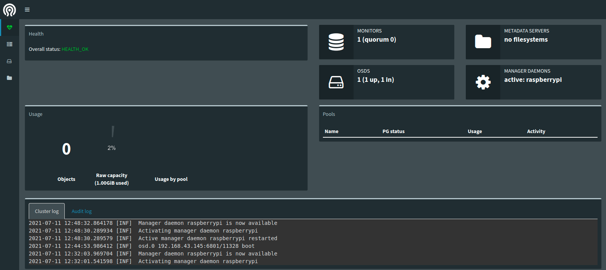

# Ceph在树莓派集群上的部署

## 什么是Ceph

## 如何在树莓派3B+集群上部署Ceph

### 单机版部署

raspbian OS

buster(Debian 10)

ceph-deploy

1. 添加源与安装

下面我们将`ceph-stable-release`替换为`pacific`

```
wget -q -O- 'https://download.ceph.com/keys/release.asc' | sudo apt-key add -
echo deb https://download.ceph.com/debian-{ceph-stable-release}/ $(lsb_release -sc) main | sudo tee /etc/apt/sources.list.d/ceph.list
```

然后安装

```
sudo apt update
sudo apt install ceph-deploy
```

切换到root用户

```
sudo -i
```

2. 安装ceph软件包


**注意**，下面的`<hostname>`都要替换为pi机的hostname，一般为`raspberrypi`，具体看bash提示符的`user@hostname`这里可以看出来，或者自行搜索hostname查看方法(可设置hostname)

首先要替换hosts，这里通过在`/etc/hosts`添加ip以及hostname可做到
```
sudo vim /etc/hosts
```
在之后添加树莓派`ip`以及树莓派的`hostname`，例如

```
192.168.43.145      raspberrypi
```

接着创建文件夹，之后一般都在新创建的文件夹下工作

```
mkdir test
cd test
ceph-deploy new <hostname>(raspberrypi)
```

然后在`ceph.conf`文件末尾添加

```
osd pool default size = 1
osd pool default min size = 1
```

然后安装ceph软件

```
ceph-deploy install --release luminous <hostname>(raspberrypi)
```

然后是初始化monitor

```
ceph-deploy mon create-initial
ceph-deploy admin <hostname>(raspberrypi)
```

然后可以通过`ceph -s`查看集群状态

接着部署`ceph mgr` manager

```
ceph-deploy mgr create <hostname>(raspberrypi)
```

然后是部署`ceph osd`，这里需要安装`lvm2`

```
# pvcreate /dev/sdb

(效果)  Physical volume "/dev/sdb" successfully created.

# vgcreate  ceph-pool /dev/sdb

  Volume group "ceph-pool" successfully created

# lvcreate -n osd0.wal -L 1G ceph-pool

  Logical volume "osd0.wal" created.
  
# lvcreate -n osd0.db -L 1G ceph-pool

  Logical volume "osd0.db" created.
  
# lvcreate -n osd0 -l 100%FREE ceph-pool

  Logical volume "osd0" created.

```

```
ceph-deploy osd create \
    --data ceph-pool/osd0 \
    --block-db ceph-pool/osd0.db \
    --block-wal ceph-pool/osd0.wal \
    --bluestore <hostname>(raspberrypi)
```

然后开启`mgr`的`dashboard`模块

```
ceph mgr module enable dashboard
```

通过一下命令，以及浏览器，你就可以拥有图形化界面观察集群现状了

```
ceph mgr services
```

一般来说效果是

```
root@raspberrypi:~/test# ceph mgr services
{
    "dashboard": "http://raspberrypi:7000/"
}
```

在浏览器上输入`<树莓派ip>:7000`即可观察效果



### 各种问题解决
#### neither `public_addr` nor `public_network` keys are defined for monitors
修改ceph.conf配置文件（此IP段根据个人情况设定），添加public_network = （主机ip）

#### RuntimeError: config file /etc/ceph/ceph.conf exists with different content; use --overwrite-conf to overwrite
执行`ceph-deploy --overwrite-conf config push （节点名字）`即可

#### admin_socket: exception getting command descriptions: [Errno 2] No such file or directory
是节点的hostname与/etc/hosts不符
执行`hostnamectl set-hostname （节点名字）`

#### 一个连续的[ceph]
类似这样
```
[ceph2][ERROR ] perf dump {<logger>} {<counter>}
[ceph2][ERROR ] log reopen
[ceph2][ERROR ] help
[ceph2][ERROR ] git_version
[ceph2][ERROR ] log flush
[ceph2][ERROR ] log dump
[ceph2][ERROR ] config unset <var>
[ceph2][ERROR ] config show
[ceph2][ERROR ] get_command_descriptions
[ceph2][ERROR ] dump_mempools
```
在节点执行`sudo pkill ceph`即可

### reference

1. [Linux中国部署方案](https://linux.cn/article-13020-1.html)
2. [树莓派无网线无鼠标无键盘安装系统并连接到网络](https://segmentfault.com/a/1190000010976507)
3. [树莓派设置无密码](https://blog.csdn.net/sinat_37842336/article/details/108042269)
4. [树莓派设置开启自动连接WiFi功能](https://blog.csdn.net/blueisman/article/details/103237934)
5. [设置Hosts，本机回环路径](https://blog.csdn.net/weixin_34314962/article/details/91916877)
6. [pvcreate](https://blog.csdn.net/weixin_34177064/article/details/91561425)
7. [centos部署五步骤](https://blog.csdn.net/weixin_43860781)
8. [文件系统](https://www.zhihu.com/search?type=content&q=ceph-deploy%E6%96%87%E4%BB%B6%E7%B3%BB%E7%BB%9F)
9. [单机版部署](https://zhuanlan.zhihu.com/p/67832892)
10. [网页版gui(在文章最后)](https://zhuanlan.zhihu.com/p/331770823)
11. [各种问题解决](https://blog.csdn.net/weixin_43357497/article/details/113763295)
